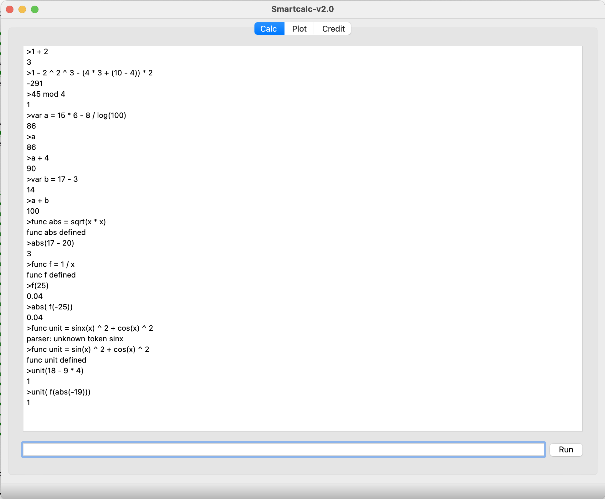
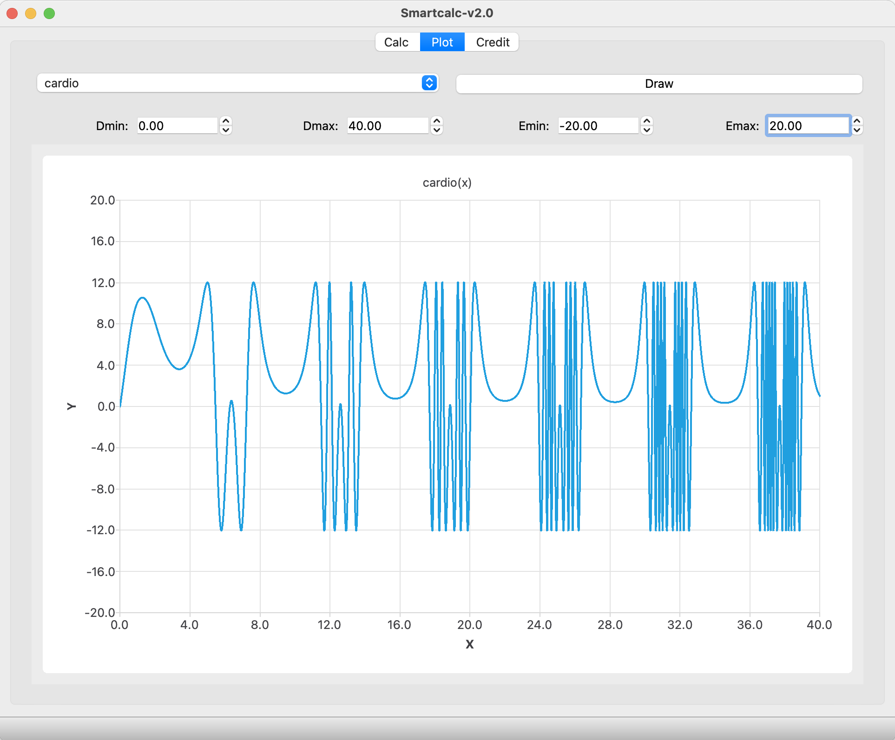
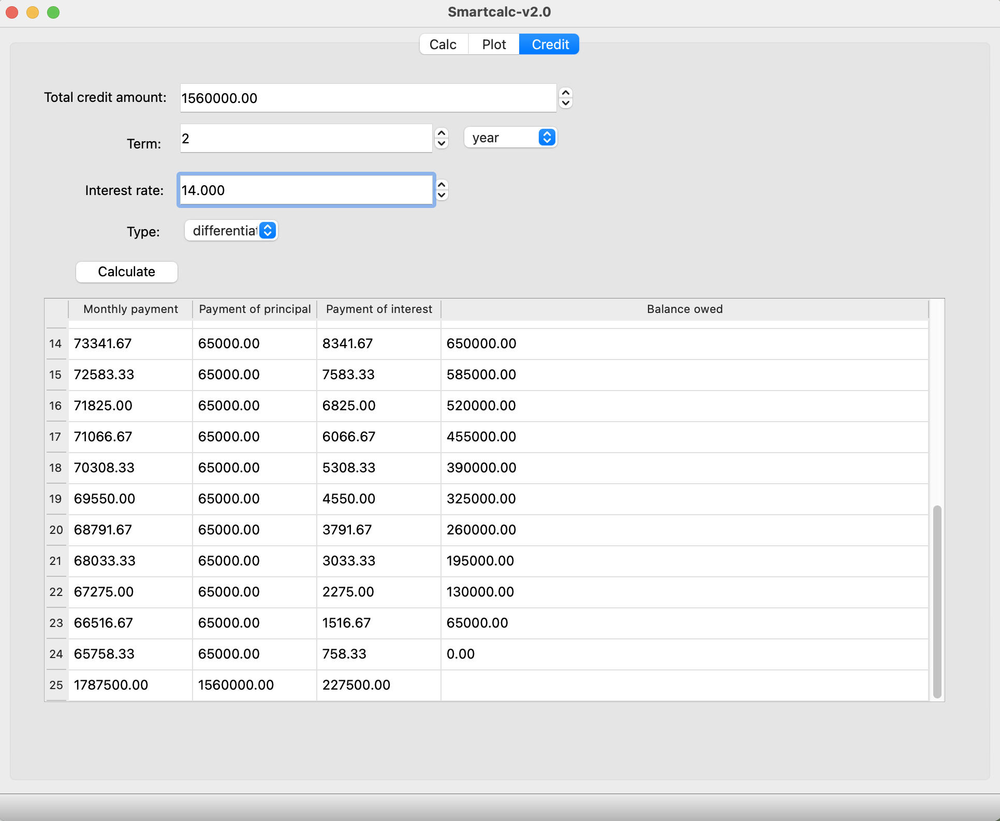

# SmartCalc_v2.0
Calculator with MVC pattern.

## Subjects

- [Subject EN](./docs/subject_en.md)
- [Subject RU](./docs/subject_ru.md)

## Solution

### Libsmartcalc

A library for calculating mathematical expressions in infix notation.
- Supports unary operators: minus `-` and plus `+`;
- binary operators: addition `+`, subtraction `-`, multiplication `*`,
  division `\`, exponentiation `^` and remainder `mod`;
- as well as functions: sine `sin`, cosine `cos`, tangent `tan`,
  arcsine `asin`, arcosine `acos`, arctangent `atan`, natural logarithm `ln`,
  decimal logarithm `log` and square root `sqrt`;
- as well as an arbitrary number of parentheses `()`.
- it also provides an interface for setting custom variables and defining custom functions from a single variable.

* `make` to compile the library;
* `test` to run unit tests;
* `coverage` to get a coverage report (depends on lcov)

### Appsmartcalc

GUI Application for the libsmartcalc library using the QT 6.2.3 framework.
The application has three operating modes:
1. Calculator:
  - Evaluate arithmetic expressions `expr`;
  - Set variables `var varname = expr`;
  - Define new functions `func funcname = expr`;
  - To get the result, press the `Run` button or the `return` key \
    

2. Plot:
  - Select a function from the list;
  - Set the boundaries of the definition area and the value area;
  - Сlick the `draw` button \
    

3. Credit
-  The loan calculator allows you to calculate monthly payment,overpayment on credit, total payment 
   

- `make` to build project;
- `PREFIX="dirname/" make install` to install programm
- `make uninstall` to uninstall
- `make tests` to run unit-tests
- `make clean` to clean project directory
- `make dvi` to create a dvi project file
- `make dist` to create project distributation
